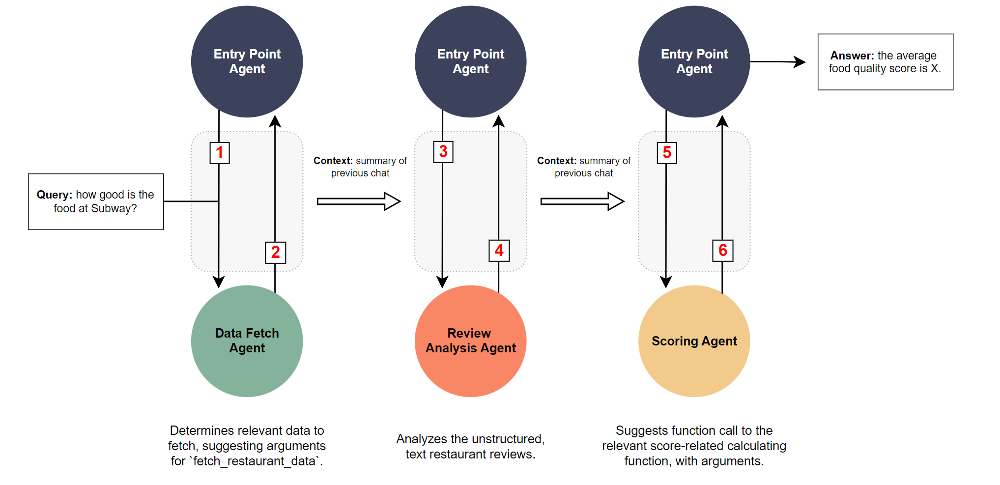

# Lab 1: Summarizing Unstructured, Natural-Language Data (Restaurant Reviews)

## 实验 1：总结非结构化自然语言数据（餐厅评论）

Large Language Models (LLMs) are extremely flexible tools and are effective in tasks that require understanding human language. Their pretraining procedure, which involves next token prediction on vast amounts of text data, enables them to develop an understanding of syntax, grammar, and linguistic meaning. One strong use case is the ability to analyze large amounts of unstructured text data, allowing us to derive insights more efficiently.
大型语言模型（LLMs）是非常灵活的工具，在需要理解人类语言的任务中非常有效。它们的预训练过程涉及在大量文本数据上进行下一个标记预测，从而使它们能够理解语法、语法结构和语言意义。一个强大的用例是分析大量非结构化文本数据，从而更高效地获取洞察。

### Lab Context

### 实验背景

This lab will focus on leveraging LLM capabilities in the context of restaurant reviews. We provide the file `restaurant-data.txt` which contains all of the restaurant reviews required for this task. These reviews are qualitative. Within the rest of the lab, you will be using the AutoGen framework to fetch restaurant reviews, summarize these reviews to extract scores for each review, and finally aggregate these scores. Your end solution will be able to answer queries about a restaurant and give back a score.
本实验将专注于在餐厅评论的背景下利用 LLM 的能力。我们提供了文件 `restaurant-data.txt`，其中包含完成此任务所需的所有餐厅评论。这些评论是定性的。在实验的其余部分中，您将使用 AutoGen 框架来获取餐厅评论，总结这些评论以提取每条评论的评分，最后汇总这些评分。您的最终解决方案将能够回答有关餐厅的查询并返回评分。

Here are some example queries: "How good is Subway as a restaurant" or "What would you rate In N Out?". Note that the restaurant names provided in the queries may not exactly match the exact syntax in `restaurant-data.txt` (like the query having the restaurant name in lower case). We will only run queries on valid restaurants, so no queries that contain invalid restaurants/structures will be tested.
以下是一些示例查询：“Subway 作为一家餐厅有多好？”或“您会给 In N Out 打多少分？”。请注意，查询中提供的餐厅名称可能与 `restaurant-data.txt` 中的确切语法不完全匹配（例如查询中的餐厅名称为小写）。我们只会对有效餐厅运行查询，因此不会测试包含无效餐厅/结构的查询。

The format is that each review is on a new line, and each line begins with the restaurant name. You'll notice that each review is qualitative, with no mention of ratings, numbers, or quantitative data. However, each review has a series of adjectives which nicely correspond to the ratings 1, 2, 3, 4, and 5, allowing you to easily associate a score for food quality and service quality for each restaurant.
格式是每条评论占一行，每行以餐厅名称开头。您会注意到，每条评论都是定性的，没有提到评分、数字或定量数据。然而，每条评论都有一系列形容词，这些形容词很好地对应了评分 1、2、3、4 和 5，使您可以轻松地为每家餐厅的食品质量和服务质量关联评分。

## AutoGen Framework

## AutoGen 框架

As mentioned earlier, for this lab, you will be using the AutoGen framework to complete the task of analyzing restaurant reviews.
如前所述，在本实验中，您将使用 AutoGen 框架来完成分析餐厅评论的任务。

AutoGen is a framework that enables the creation of multi-agent workflows involving multiple LLMs. Essentially, you can think of it as a way to define "control flows" or "conversation flows" between multiple LLMs. This way, you can chain together several individual LLM agents, having them all work together by conversing with each other to accomplish a larger task. Through AutoGen, users can define networks of LLM agents, enabling complex reasoning, self-evaluating, data processing pipelines, and much more.
AutoGen 是一个框架，使得可以创建涉及多个 LLM 的多代理工作流。本质上，您可以将其视为定义多个 LLM 之间的“控制流”或“对话流”的一种方式。通过这种方式，您可以将多个单独的 LLM 代理链在一起，让它们通过相互对话来完成更大的任务。通过 AutoGen，用户可以定义 LLM 代理网络，从而实现复杂的推理、自我评估、数据处理管道等。

For this lab, we recommend getting a sense of the common conversation patterns. Being familiar with the patterns of inter-agent communication will allow you to better architect the system needed for the lab. Here are some of the [Common Conversation Patterns:](https://microsoft.github.io/autogen/docs/tutorial/conversation-patterns)
在本实验中，我们建议了解常见的对话模式。熟悉代理之间的通信模式将使您能够更好地构建实验所需的系统。以下是一些[常见对话模式：](https://microsoft.github.io/autogen/docs/tutorial/conversation-patterns)

- Two-Agent Chats
- 双代理聊天
- Sequential Chats
- 顺序聊天
- Group Chat
- 群聊

We also suggest reading the reference for the `ConversableAgent` class. [Docs Link](https://microsoft.github.io/autogen/docs/reference/agentchat/conversable_agent). Particularly, we suggest reading the functions related to `initiate_chat`, the arguments for this, and the `result` that will be returned from calling this function.
我们还建议阅读 `ConversableAgent` 类的参考资料。[文档链接](https://microsoft.github.io/autogen/docs/reference/agentchat/conversable_agent)。特别是，我们建议阅读与 `initiate_chat` 相关的函数、其参数以及调用此函数时将返回的 `result`。

For the entirety of the lab, we **strongly recommend using the GPT-4o-mini model** due to its cost efficiency. It will be more than 10X cheaper than using GPT-4o while providing "similar" levels of intelligence (at least for the purpose of this lab), so you can expect to incur a much lower cost. The staff solution uses the GPT-4o-mini model.
在整个实验过程中，我们**强烈建议使用 GPT-4o-mini 模型**，因为它具有成本效益。它将比使用 GPT-4o 便宜 10 倍以上，同时提供“类似”的智能水平（至少对于本实验而言），因此您可以预期成本会大大降低。工作人员解决方案使用 GPT-4o-mini 模型。

### Additional Features of AutoGen

### AutoGen 的其他功能

Here are some notable features and keywords of AutoGen that may be helpful in solving the lab:
以下是 AutoGen 的一些显著功能和关键字，可能对解决实验有帮助：

- Termination Message
- 终止消息
- Max Messages Per Round
- 每轮最大消息数
- Summary Method
- 摘要方法
- Summary Args
- 摘要参数

## Lab Setup: Environment Variables, Virtual Environment, and Dependencies

## 实验设置：环境变量、虚拟环境和依赖项

We recommend using a virtual environment to complete this lab, then installing all of the packages listed in `requirements.txt`.
我们建议使用虚拟环境来完成本实验，然后安装 `requirements.txt` 中列出的所有软件包。

Please create your own API Key and do not leak your OpenAI API key. To create your own API Key, you can look at the following documentation: <https://platform.openai.com/docs/quickstart>. Using the GPT-4o-mini model, we expect the cost of this lab to be < $1. Store your API key as an environment variable named `OPENAI_API_KEY` and use this alias for the entirety of the lab.
请创建您自己的 API 密钥，不要泄露您的 OpenAI API 密钥。要创建您自己的 API 密钥，您可以查看以下文档：<https://platform.openai.com/docs/quickstart。使用> GPT-4o-mini 模型，我们预计本实验的成本将低于 1 美元。将您的 API 密钥存储为名为 `OPENAI_API_KEY` 的环境变量，并在整个实验过程中使用此别名。

## Lab 1: Task Description

## 实验 1：任务描述

### Recommended Approach

### 推荐方法


The above figure is a diagram of the recommended architecture for this lab. It follows a sequential conversation pattern between two agents. We choose this approach because it's the simplest solution: the pipeline is essentially a directed graph, where we first fetch the restaurant reviews, analyze them, then call a function, but with an additional "supervising" entrypoint agent.
上图是本实验推荐架构的示意图。它遵循两个代理之间的顺序对话模式。我们选择这种方法是因为它是最简单的解决方案：管道本质上是一个有向图，我们首先获取餐厅评论，分析它们，然后调用一个函数，但有一个额外的“监督”入口代理。

The entry point agent is always the agent responsible for initiating the chat with other agents. Relevant summaries of previous chats between agent pairs are carried over as contexts to other chats. For example, the fetched reviews may be carried over as context from the first conversation to the second. To learn more about summaries, please refer to the `summary_method` in AutoGen.
入口代理始终是负责与其他代理发起聊天的代理。代理对之间先前聊天的相关摘要将作为上下文传递给其他聊天。例如，获取的评论可能会作为上下文从第一次对话传递到第二次对话。要了解有关摘要的更多信息，请参阅 AutoGen 中的 `summary_method`。

### Starter Code

### 启动代码

- `main.py`: where the implementation primarily will go. The starter code is already annotated.
- `main.py`：主要实现的地方。启动代码已经注释好了。
- `test.py`: public tests. Can run `python test.py`, which will print out the test result summaries. Use these as a sanity check to ensure your implementation is working as intended.
- `test.py`：公共测试。可以运行 `python test.py`，它将打印出测试结果摘要。使用这些作为健全性检查，以确保您的实现按预期工作。
- `calculate_overall_score`: function for determining the overall score of a restaurant.
- `calculate_overall_score`：用于确定餐厅总体评分的函数。
- `requirements.txt`: contains all of the necessary packages the lab requires.
- `requirements.txt`：包含实验所需的所有必要软件包。

### Task 1: Fetching the Relevant Data

### 任务 1：获取相关数据

The first step is to figure out which restaurant review data we need. We should analyze the query using the data fetch agent to determine the correct function call to the fetch function. This data fetch agent will suggest a function call with particular arguments. Then, the entry point agent will execute the suggested function call. By the end of this section, you should be able to fetch the correct reviews for the appropriate restaurants.
第一步是弄清楚我们需要哪些餐厅评论数据。我们应该使用数据获取代理来分析查询，以确定对获取函数的正确函数调用。此数据获取代理将建议带有特定参数的函数调用。然后，入口代理将执行建议的函数调用。在本节结束时，您应该能够为适当的餐厅获取正确的评论。

More explicitly, you will need to write the prompts for the entrypoint agent, register the function `fetch_restaurant_data` for calling/execution, fill out the function `fetch_restaurant_data`, and determine the right arguments for initiating the chat with the entrypoint agent.
更明确地说，您需要为入口代理编写提示，注册用于调用/执行的函数 `fetch_restaurant_data`，填写函数 `fetch_restaurant_data`，并确定与入口代理发起聊天的正确参数。

**Hint: We will not test invalid queries. If a restaurant is not within the data set, it is fine. We will not test such a case.**
**提示：我们不会测试无效查询。如果餐厅不在数据集中，那也没关系。我们不会测试这种情况。**

**Hint: It will be worthwhile to understand the different termination conditions in the AutoGen framework (refer to the AutoGen documentation).**
**提示：了解 AutoGen 框架中的不同终止条件是值得的（请参阅 AutoGen 文档）。**

### Task 2: Analyzing Reviews

### 任务 2：分析评论

The next step is creating an agent that can analyze the reviews fetched in the previous section. More specifically, this agent should look at every single review corresponding to the queried restaurant and extract two scores:
下一步是创建一个可以分析上一节中获取的评论的代理。更具体地说，该代理应查看与查询的餐厅相对应的每条评论并提取两个评分：

- `food_score`: the quality of food at the restaurant. This will be a score from 1-5.
- `food_score`：餐厅的食品质量。这将是一个 1-5 的评分。
- `customer_service_score`: the quality of customer service at the restaurant. This will be a score from 1-5.
- `customer_service_score`：餐厅的客户服务质量。这将是一个 1-5 的评分。

The agent should extract these two scores by looking for keywords in the review. Each review has keyword adjectives that correspond to the score that the restaurant should get for its `food_score` and `customer_service_score`. Here are the keywords the agent should look out for:
代理应通过在评论中查找关键字来提取这两个评分。每条评论都有关键字形容词，这些形容词对应于餐厅应获得的 `food_score` 和 `customer_service_score` 的评分。以下是代理应注意的关键字：

- Score 1/5 has one of these adjectives: awful, horrible, or disgusting.
- 评分 1/5 具有以下形容词之一：糟糕、可怕或恶心。
- Score 2/5 has one of these adjectives: bad, unpleasant, or offensive.
- 评分 2/5 具有以下形容词之一：糟糕、不愉快或令人反感。
- Score 3/5 has one of these adjectives: average, uninspiring, or forgettable.
- 评分 3/5 具有以下形容词之一：一般、乏味或令人难忘。
- Score 4/5 has one of these adjectives: good, enjoyable, or satisfying.
- 评分 4/5 具有以下形容词之一：好、愉快或令人满意。
- Score 5/5 has one of these adjectives: awesome, incredible, or amazing.
- 评分 5/5 具有以下形容词之一：棒极了、难以置信或令人惊叹。

Each review will have exactly only two of these keywords (adjective describing food and adjective describing customer service), and the score (N/5) is only determined through the above listed keywords. No other factors go into score extraction. To illustrate the concept of scoring better, here's an example review.
每条评论将恰好只有这两个关键字（描述食物的形容词和描述客户服务的形容词），评分（N/5）仅通过上述关键字确定。没有其他因素会影响评分提取。为了更好地说明评分的概念，以下是一个示例评论。

> The food at McDonald's was average, but the customer service was unpleasant. The uninspiring menu options were served quickly, but the staff seemed disinterested and unhelpful.
> 麦当劳的食物一般，但客户服务不愉快。乏味的菜单选项上菜很快，但员工似乎不感兴趣且不乐于助人。

We see that the food is described as "average", which corresponds to a `food_score` of 3. We also notice that the customer service is described as "unpleasant", which corresponds to a `customer_service_score` of 2. Therefore, the agent should be able to determine `food_score: 3` and `customer_service_score: 2` for this example review.
我们看到食物被描述为“一般”，对应的 `food_score` 为 3。我们还注意到客户服务被描述为“不愉快”，对应的 `customer_service_score` 为 2。因此，代理应能够确定此示例评论的 `food_score: 3` 和 `customer_service_score: 2`。

We provide the data of all restaurant reviews in the file `restaurant-reviews.txt`. It has the following format:
我们在文件 `restaurant-reviews.txt` 中提供了所有餐厅评论的数据。它具有以下格式：

```txt
<restaurant_name>. <review>.
<restaurant_name>. <review>.
<restaurant_name>. <review>.
...
...
...
<restaurant_name>. <review>.
```

By the end of this section, your agent should have extracted two scores (`food_score` and `customer_service_score`) for **every** review associated with the restaurant in the query. All reviews for every restaurant should be able to fit within the context window, so you can summarize them all at once.
在本节结束时，您的代理应已为查询中与餐厅相关的**每条**评论提取了两个评分（`food_score` 和 `customer_service_score`）。每家餐厅的所有评论都应能够适应上下文窗口，因此您可以一次性总结所有评论。

To accomplish this, you need to write the prompt so that this agent can score each review, and you need to initiate the chat with the review analyzer agent (add an argument dictionary to `entrypoint_agent.initiate_chats`).
为此，您需要编写提示，以便此代理可以对每条评论进行评分，并且您需要与评论分析代理发起聊天（将参数字典添加到 `entrypoint_agent.initiate_chats`）。

**Hint: For this agent, it will help to explicitly list down keywords corresponding to food and customer service. Prompt your agent so that it enumerates through the reviews, extracts the keyword associated with food, extracts the keyword associated with customer service, and then creates two scores (food and customer service) for that review.**
**提示：对于此代理，明确列出与食物和客户服务相对应的关键字会有所帮助。提示您的代理枚举评论，提取与食物相关的关键字，提取与客户服务相关的关键字，然后为该评论创建两个评分（食物和客户服务）。**

**Hint: It will be worthwhile to look into different arguments for `summary_method` (refer to the AutoGen documentation)**
**提示：研究 `summary_method` 的不同参数是值得的（请参阅 AutoGen 文档）**

### Task 3: Scoring Agent

### 任务 3：评分代理

The final step is creating a scoring agent. This agent will need to look at all of the review's `food_score` and `customer_service_score` to make a final function call to `calculate_overall_score`. This agent should be provided a summary with enough context from the previous chat to determine the arguments for the function `calculate_overall_score`. Complete the implementation for the scoring function `calculate_overall_score` with the descriptions provided in the comments. Please don't modify the function signature or the return format. Also, write the necessary prompts for this agent. At the end of this section, you should be fully complete. You should be able to answer queries regarding any restaurant in the list of restaurants.
最后一步是创建一个评分代理。此代理需要查看所有评论的 `food_score` 和 `customer_service_score`，以最终调用 `calculate_overall_score` 函数。应为此代理提供一个摘要，其中包含足够的上下文，以确定 `calculate_overall_score` 函数的参数。根据注释中提供的描述完成评分函数 `calculate_overall_score` 的实现。请不要修改函数签名或返回格式。此外，为此代理编写必要的提示。在本节结束时，您应该完全完成。您应该能够回答有关餐厅列表中任何餐厅的查询。

**Hint: It will be worthwhile to look into different arguments for `summary_method`. It will also be worthwhile to re-read the documentation on function calling.**
**提示：研究 `summary_method` 的不同参数是值得的。重新阅读有关函数调用的文档也是值得的。**

## Testing, Submission, and Grading

## 测试、提交和评分

We provide a set of public tests within the script `test.py`, which can be used as a sanity check for the lab implementation. If you successfully pass all tests, it means your implementation had the right score for the provided test cases and is fully functioning.
我们在脚本 `test.py` 中提供了一组公共测试，可用作实验实现的健全性检查。如果您成功通过所有测试，则意味着您的实现对提供的测试用例具有正确的评分并且完全正常运行。

For UC Berkeley students, we will run additional tests, which you can expect to be similar to the tests within the script `test.py`. We provide a slight tolerance for each test case to account for any minor hallucinations. **Be sure to fill out** `student_info.json` with your information, otherwise there may be complications with grading. Zip your entire project folder, and upload the folder into Gradescope. From this, our autograder will run hidden tests on the assignment. Note: you will not receive immediate feedback. However, if you pass the public tests, there is a high chance of receiving full score on this assignment as the private tests are similar in format.
对于 UC Berkeley 的学生，我们将运行额外的测试，您可以预期这些测试与脚本 `test.py` 中的测试类似。我们为每个测试用例提供了轻微的容差，以解释任何轻微的幻觉。**请务必填写** `student_info.json`，否则评分可能会出现问题。压缩整个项目文件夹，并将文件夹上传到 Gradescope。由此，我们的自动评分器将对作业运行隐藏测试。注意：您不会立即收到反馈。但是，如果您通过了公共测试，则很有可能在此作业中获得满分，因为私有测试的格式类似。

For MOOC students, please use the public tests to verify your solution.
对于 MOOC 学生，请使用公共测试来验证您的解决方案。
